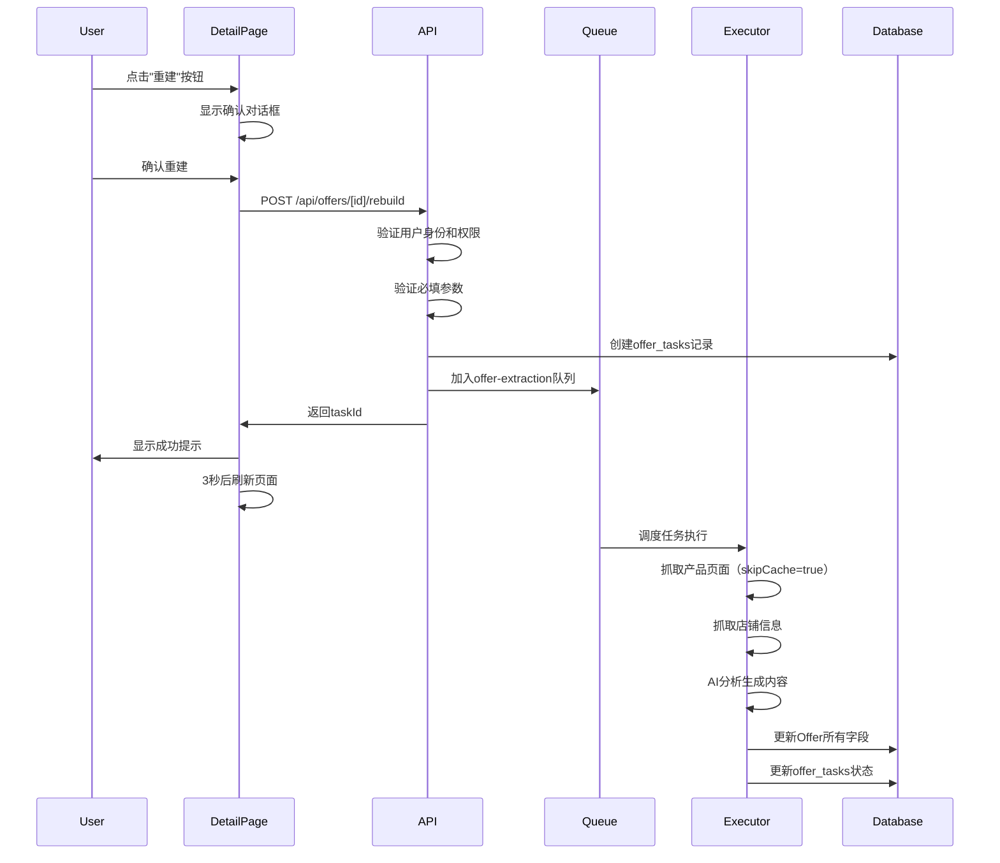

# Rebuild Offer Feature Implementation

**日期**: 2025-12-10
**状态**: ✅ 完成

---

## 📋 功能描述

为已创建的Offer提供"重建"功能，用户可以重新运行完整的Offer创建流程，更新所有产品信息、品牌信息、AI分析等字段。

### 用户场景
- Offer信息过时，需要更新最新产品数据
- 产品页面发生变化（价格、描述、评论等）
- AI分析策略升级，需要重新生成分析结果
- 数据抓取失败或不完整，需要重新抓取

---

## 🛠️ 技术实现

### 1. 后端API

**文件**: `src/app/api/offers/[id]/rebuild/route.ts`

**功能**:
```typescript
POST /api/offers/[id]/rebuild

1. 验证用户身份和Offer所有权
2. 验证必填参数（affiliate_link, target_country）
3. 创建新的offer_tasks记录（关联到现有offer_id）
4. 设置skipCache: true强制重新抓取
5. 将任务加入队列
6. 返回taskId供前端追踪进度
```

**关键参数**:
- `offer_id`: 关联到现有Offer，任务完成后更新该Offer
- `skip_cache: true`: 强制跳过缓存，重新抓取数据
- `skip_warmup: false`: 保留预热功能

**返回值**:
```json
{
  "success": true,
  "taskId": "uuid",
  "offerId": 123,
  "message": "Offer重建任务已创建，正在后台处理"
}
```

### 2. 前端UI

**文件**: `src/app/(app)/offers/[id]/page.tsx`

**修改内容**:

1. **状态管理**:
   - `rebuilding`: 重建按钮加载状态
   - `isRebuildDialogOpen`: 确认对话框显示状态
   - `rebuildError`: 重建错误信息

2. **重建按钮**:
   - 位置：Offer详情页顶部导航栏，位于"编辑"和"删除"按钮之间
   - 样式：蓝色主题（`text-indigo-600`）
   - 禁用条件：
     - `rebuilding`: 正在重建时
     - `!offer.affiliateLink`: 缺少推广链接时
   - 悬浮提示：显示禁用原因或功能说明

3. **确认对话框**:
   - 标题：确认重建Offer
   - 内容：
     - 品牌名称提示
     - 重建说明（5条）：
       1. 将重新抓取产品页面和店铺信息
       2. 重新运行AI分析生成所有内容
       3. 更新品牌信息、产品描述、评价分析、竞品分析等所有字段
       4. 处理时间约2-5分钟，后台异步执行
       5. **注意：将覆盖现有所有数据**
   - 错误提示：显示重建失败原因
   - 操作按钮：
     - "取消"：关闭对话框
     - "确认重建"：执行重建操作（显示加载状态）

4. **重建处理流程**:
```typescript
handleRebuild() {
  1. 设置loading状态
  2. 调用POST /api/offers/[id]/rebuild
  3. 处理响应：
     - 成功：显示成功提示（含taskId）
     - 失败：显示错误信息在对话框内（不关闭对话框）
  4. 3秒后自动刷新页面数据
}
```

---

## 📊 更新字段

重建后将更新Offer的以下所有字段：

### 产品标识
- `brand`: 品牌名称
- `offer_name`: 产品名称
- `category`: 产品分类

### 品牌信息
- `brand_description`: 品牌描述
- `unique_selling_points`: 独特卖点

### 产品描述
- `product_highlights`: 产品亮点
- `target_audience`: 目标受众

### 评价分析
- `review_analysis`: 评论分析（JSON）
- `enhanced_review_analysis`: 增强评论分析
- `ai_reviews`: AI评论总结

### 竞品分析
- `competitor_analysis`: 竞品分析（JSON）
- `ai_competitive_edges`: AI竞品优势

### 分类信息
- `product_categories`: 产品分类（JSON数组）
- `industry_code`: 行业代码

### AI分析
- `ai_analysis_v32`: AI分析结果（V32版本）
- `ai_keywords`: AI关键词

### 抓取数据
- `scraped_data`: 原始抓取数据（JSON）
- `visual_analysis`: 视觉分析

### 价格佣金
- `product_price`: 产品价格
- `commission_payout`: 佣金金额

### URL信息
- `final_url`: 最终URL
- `final_url_suffix`: URL后缀

### 时间戳
- `updated_at`: 更新时间

---

## 🔄 执行流程



---

## 🎯 用户体验

### 正常流程
1. 用户访问Offer详情页
2. 点击顶部导航栏的"重建"按钮
3. 弹出确认对话框，说明重建内容和注意事项
4. 点击"确认重建"
5. 显示成功提示：`Offer重建任务已启动，taskId: xxx`
6. 3秒后页面自动刷新，可能看到`scrape_status`变为`pending`或`in_progress`
7. 等待2-5分钟，刷新页面查看更新后的数据

### 错误处理
- **缺少推广链接**：按钮禁用，悬浮提示"缺少推广链接，无法重建"
- **用户未登录**：返回401错误，提示"请先登录"
- **Offer不存在或无权限**：返回404错误，提示"Offer不存在或无权限访问"
- **网络错误**：在对话框内显示错误信息，不关闭对话框，用户可点击"重试"

---

## 📝 代码变更

### 新增文件
- `src/app/api/offers/[id]/rebuild/route.ts` (174行)

### 修改文件
- `src/app/(app)/offers/[id]/page.tsx`
  - 新增状态：`rebuilding`, `isRebuildDialogOpen`, `rebuildError`
  - 新增函数：`handleRebuild()`
  - 新增UI：重建按钮、重建确认对话框

---

## ✅ 测试清单

### 功能测试
- [ ] 点击"重建"按钮显示确认对话框
- [ ] 对话框显示正确的品牌名称和说明
- [ ] 点击"取消"关闭对话框
- [ ] 点击"确认重建"成功创建任务
- [ ] 成功提示显示taskId
- [ ] 3秒后页面自动刷新
- [ ] 缺少推广链接时按钮禁用
- [ ] 悬浮提示显示正确

### 错误测试
- [ ] 未登录用户尝试重建（401错误）
- [ ] 访问不存在的Offer（404错误）
- [ ] 访问无权限的Offer（404错误）
- [ ] 网络错误显示在对话框内
- [ ] 错误状态下可以重试

### 后端测试
- [ ] offer_tasks记录正确创建
- [ ] offer_id字段正确关联
- [ ] skipCache设置为true
- [ ] 任务成功加入队列
- [ ] 任务执行后更新所有字段
- [ ] 原有Offer数据被覆盖

### 性能测试
- [ ] 单次重建任务完成时间（目标：2-5分钟）
- [ ] 并发多个重建任务不冲突
- [ ] 重建过程中不影响其他用户操作

---

## 🚀 后续优化建议

### 短期（1-2周）
1. **进度追踪**：实现SSE或WebSocket实时显示重建进度
2. **状态指示**：在详情页显示重建状态（重建中、重建失败等）
3. **通知功能**：重建完成后发送邮件或站内通知

### 中期（1-2月）
1. **选择性重建**：允许用户选择只重建特定字段（如只重建评论分析）
2. **版本对比**：显示重建前后的数据差异
3. **批量重建**：支持批量选择多个Offer进行重建

### 长期（3-6月）
1. **智能重建**：自动检测产品数据变化，建议重建
2. **定时重建**：设置定时任务自动重建过期数据
3. **重建历史**：记录重建历史，支持回滚到历史版本

---

## 🎉 总结

本次实现成功为用户提供了手动重建Offer的功能，解决了产品数据过期、AI分析升级等场景下的数据更新需求。

**关键特性**：
- ✅ 简洁直观的UI交互
- ✅ 完整的错误处理和用户提示
- ✅ 后台异步执行，不阻塞用户操作
- ✅ 强制跳过缓存，确保数据新鲜
- ✅ 完整更新所有Offer字段

**技术亮点**：
- 复用现有offer_tasks和队列系统
- 通过offer_id关联实现原地更新
- skipCache机制确保数据新鲜度
- 前后端分离，职责清晰

---

**实施人员**: Claude Code
**审核状态**: 待审核
**部署状态**: 开发完成，待测试
